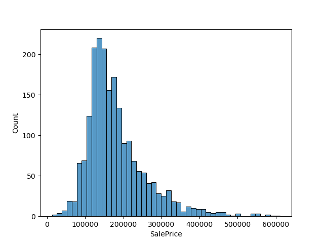
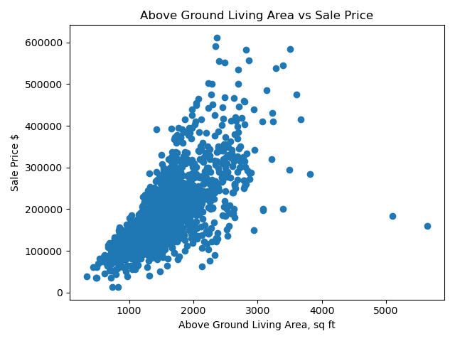
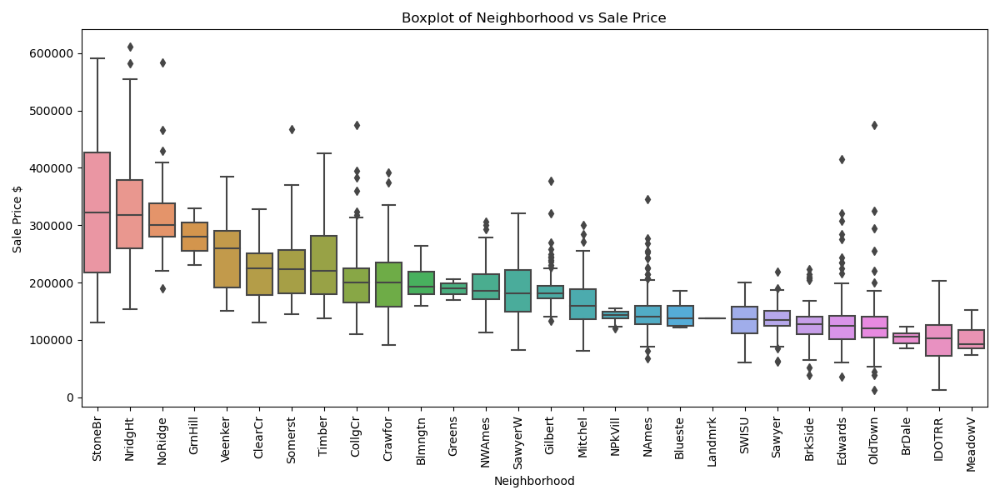
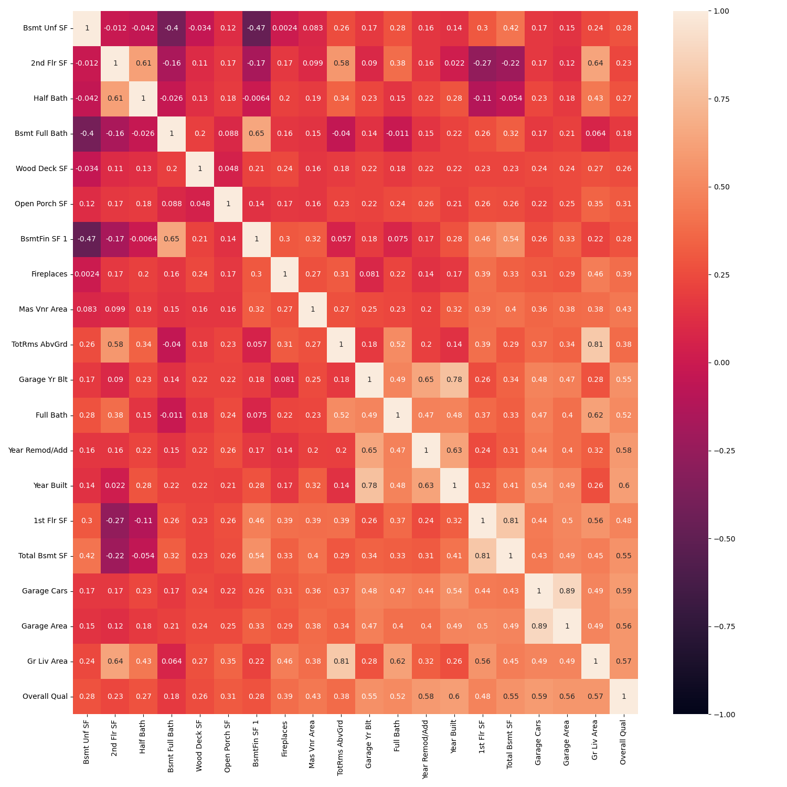
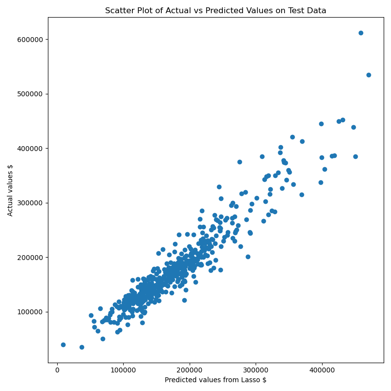

# Project 2 - Ames Housing Data and Kaggle Challenge

### Problem Statement: You are an estate agent in Ames, Iowa. Your job is to use the dataset to predict Sale Price and also understand which areas are desirable/unattractive. You will also use this model to advise clients on how to improve the value of their homes.

### 1. EDA and Cleaning: 

- I loaded the dataset and initially looked at a few initial charts such as a histogram of the sale price, and some scatter plots of various features that I thought would correlate well with sale price.
- I found that features related to size and square footage correlated well, as one would expect, and oddly, year sold had little impact which surprised me given I expected some impact from the financial crisis (ie lower sale prices in 2008/09).

     

- I then went about cleaning my data and addressing null values, of which there were many.
- Upon investigation on a feature by feature basis, most of these null values seemed to relate to a feature being non-existent, rather than missing data, with for example 'Basement Condition' as a null relating to a house having no basement. This was obviously an assumption and there may well have been actual missing data within the dataset but I felt it was a reasonable assumption to make. As such, we applied a 'None' or zero to many of the categorical or related numerical features using fillna. However, in the case of Garage Year Built, I applied the mean value as I wanted to avoid using a zero value given the impact this would have on the model. 
- I saved this new dataset as a csv file.

### 2. Preprocessing and Deature Engineering: 

- In order to reduce the number of features to something more manageable, I started looking at feature correlations across the numerical variables and kept those with a 0.2 or greater correlation to Sale Price.
- I then started building my initial model, using 25% of the data as a test set, which seemed reasonable as the dataset is fairly large. We want to give the model sufficient test data to prevent overfitting as there are many features, which we will be adding to with dummied categorical variables.
- I also scaled the data since we are dealing with features with widely different ranges.
- I then ran our initial feature list through a Linear Regression, Lasso and Ridge model. The results were very similar. The model was actually slightly underfit, although this was reduced on cross validation. All models scored a 0.76 on cross validation with an RMSE of around $36k
- I then tried to improve on this through adding categorical variables to the model, using seaborn's boxplot function to initially look for correlated features and adding the most promising candidates to my model, starting with neighborhood.

    

- I looked at the distributions of these features, and used get_dummies to add them to the model, starting with Neighborhood, which had a significant impact on the train and test score along with the RMSE.
- I then went through the rest of the features, adding those that improved the model and discarding those that had a negative or negligible impact.
- I then looked at coefficients and correlations across the new feature list and removed 4 of the least relevant features. This resulted in a marginal improvement in our test score.

    

- After that I looked for collinearity and removed for example 'Total Rooms Above Ground' and 'Garage Year Built' as these were highly correlated to Above Ground Living Area and Year Built. Multicollinearity is important to address as the model finds it difficult to understand the impact of individual features and can also lead to overestimated coefficients as both features are moving in tandem. It can also lead to overfitting. Again, this resulted in a small improvement in our test score.
- Lastly, we removed outliers. I used the Above Ground Living Area as a filter as I noticed that the data was heavily right skewed and at high values or in other words, there was some heteroscedasticity, ie the variance changed with an increase in the predictor variable. In further work, this might be interesting to investigate using polynomials but for now I removed outliers above 3000 square feet, which looked like a sensible cut off point. This had a fairly dramatic impact, improving our test score by 0.02 and reducing our RMSE by over $5000 using linear regression.
- I now had a feature set that was scoring well on both train and test data across LR, Ridge and Lasso, with train and test scores fairly in line, suggesting limited overfitting.
- I ran cross validation scores on the three models, which led to a negaitve value for LR, so I decided to take Ridge and Lasso forward, which each had a cross validation score of 0.89, indicating limited overfitting. We can see the predicted vs actual data in the chart below.
- I saved this feature set as Model 7.

    

### 3. Model Tuning  

- I then hyperparameter optimized the Ridge and Lasso models and ran a cross validation score.
- The performance was very similar, with Lasso marginally better (Cross val: 0.8940, Train 0.9127, Test: 0
9024, RMSE: 22773), so I used this as my final model.
- I then used the correlations and Lasso coefficients to build a dataframe with the highest coefficient and correlation features to determine which were the strongest predictors of house price value
- We saw that the main determinants of Sale Price include overall quality, above ground living area, basement area, year built and year of remodelling, all of which have a high correlation to sale price and a high feature coefficient. This was largely as expected.

### Overall conclusions
- Our final model performs well across train, test and cross validation scores, and suggests low overfitting.
- To improve the model further, I would look likely look at polynomial features as there are likely a number of features that have a non-linear relationship with price.
- The most important features are above ground living area (sq ft) and overall quality, External Quality, Basement square footage and Year Built.
- Year of remodelling is also important, suggesting there is a return to remodelling work.
- All of these have high coefficients and correlation
- Neighborhood is also very important.
- To add value, homeowners should 1) increase the living area 2) increase the exterior quality 3) increase the garage area, 4) consider doing some remodelling.

